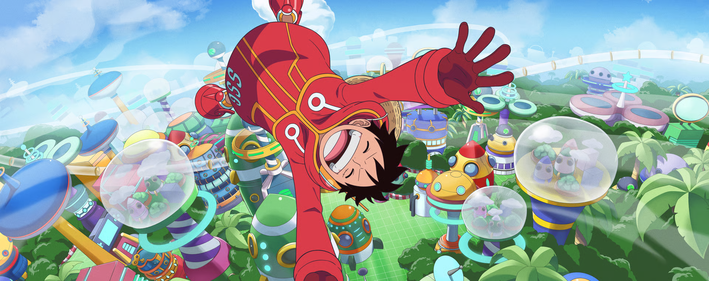

# One Piece - Characters affiliation network

## Overview
The One Piece world is amazing. But it's also huge : with over 1500 characters, it can quickly become overwhelming. With this project, I want to make sense of this vast universe : I will explore the relationships between all One Piece characters by looking at shared crews, organizations, or alliances. By building a network where each character is a node and connections represent common affiliations, the objective is to gain insights into hidden patterns and natural groupings, to better understand and visualize the One Piece world.

## Getting Started

### 🛠️ Data extraction and creation

I used the [Crawl4AI](https://docs.crawl4ai.com/) framework to automate the extraction of structured data from the One Piece Fandom Wiki.

1. **Character list extraction**  
   I targeted the [List of Canon Characters](https://onepiece.fandom.com/wiki/List_of_Canon_Characters) page using a custom CSS schema to extract character names and their profile URLs.

2. **Infobox data**   
   For each character URL, I navigated to their dedicated wiki page and extracted infobox attributes such as affiliations, occupations, origin, and more.

   All the extracted information is compiled into a structured dataframe.

## NEXT STEPS

1. **Build the network**  
Create a graph where characters are nodes and shared affiliations create edges.

2. **Compute features**  
Calculate centrality metrics and run a node-embedding algorithm.

3. **Visualization**  

4. **Clustering**  
Merge network embeddings with other features, run clustering algorithms, and analyze the results

